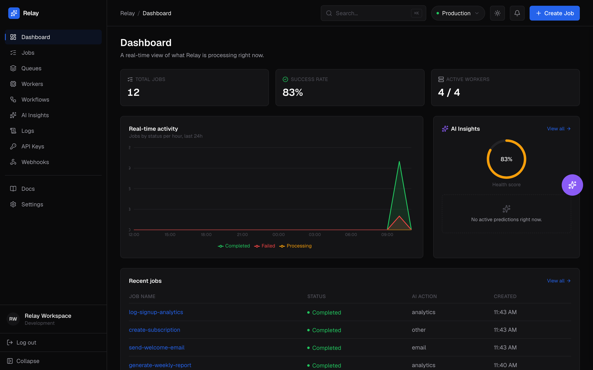
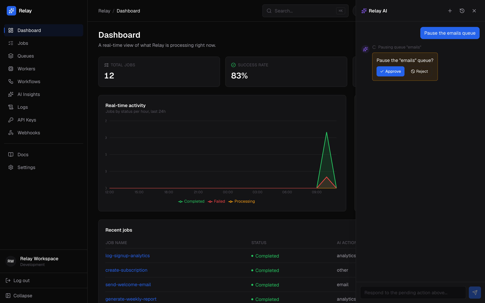
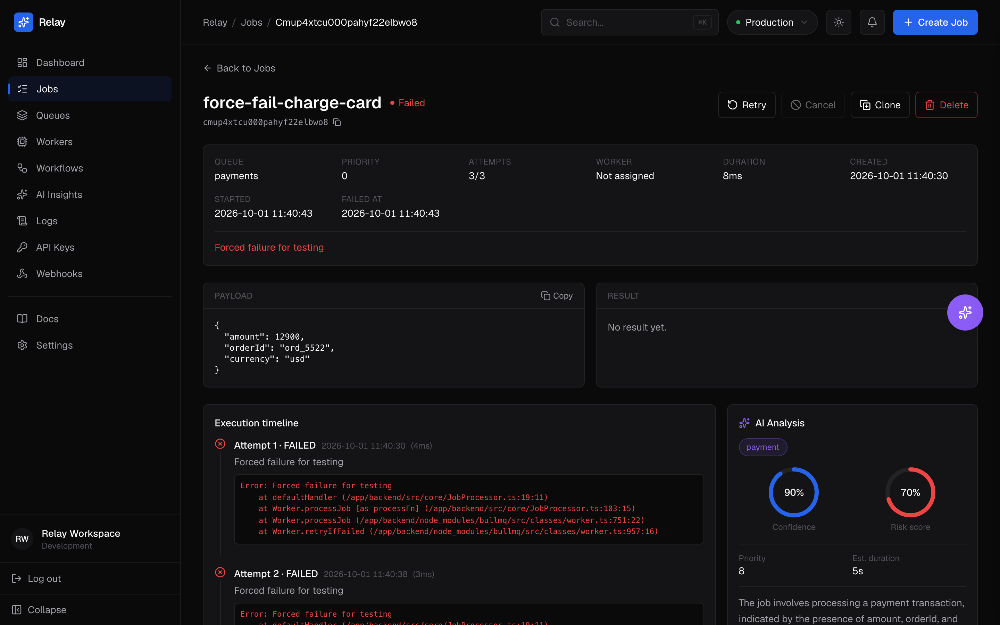
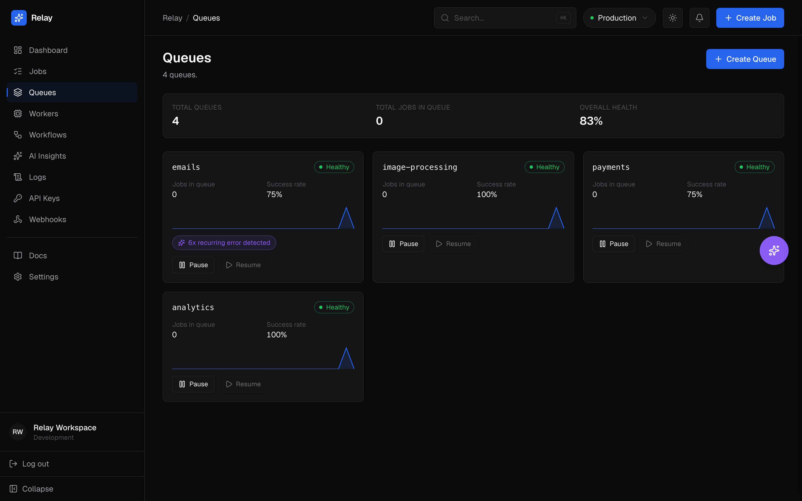
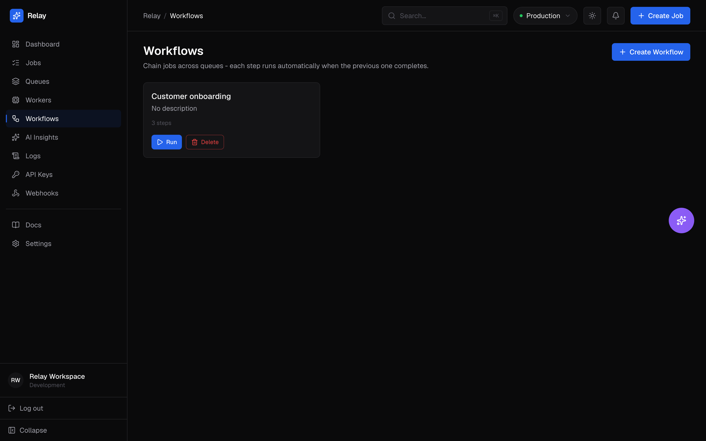

# Relay

**Infrastructure that thinks.** An AI-native background job processing platform — a job queue that classifies your jobs, diagnoses its own failures, and lets you operate it in plain English.

> 🚧 **Status: Demo / Work in Progress.** Relay is a fully functional, deployed product built solo end-to-end — currently running as a public demo while it's developed further toward a real startup. See [Status & Roadmap](#status--roadmap) below for what's live vs. what's next.

---

## Screenshots

### Dashboard


### AI Chat Agent


### Job Detail — AI Error Analysis


### Queues


### Workflows


---

## The Problem

Every backend system has background jobs — sending emails, processing payments, resizing images, syncing data. Standard job queues (BullMQ, Celery, Sidekiq) give you a queue and basic retries. Everything else — figuring out *why* a job keeps failing, deciding how long to wait before retrying, routing different job types correctly — is manual, tribal knowledge that lives in a senior engineer's head until it breaks at 2am.

## What Relay Does

Relay layers AI onto the queue itself, not just the jobs running through it:

- 🤖 **AI Job Classification** — incoming jobs are automatically categorized, risk-scored, and prioritized by an LLM instead of hardcoded rules
- 🔍 **AI Error Analysis** — failed jobs get a real root-cause explanation, not just a raw stack trace. Recurring failure patterns are fingerprinted and remembered, so the system gets smarter about *your specific* failure modes over time
- 💬 **AI Chat Agent** — ask "why did job #4521 fail?" or "pause the payments queue" in plain English. The agent calls real backend tools to answer or act, with human-in-the-loop confirmation before anything destructive runs
- 🔗 **Multi-step Workflows** — chain jobs across queues into a pipeline that auto-advances on success and halts cleanly on failure
- 📊 **Full observability** — a dashboard for job history, queue health, worker status, and AI-generated insights/predictions
- 🔔 **Webhooks** — real-time notifications on `job.completed` / `job.failed`
- 📦 **TypeScript SDK** — `@relay/sdk` for integrating Relay into any Node/TS backend

---

## Tech Stack

| Layer | Technology |
|---|---|
| Backend | Node.js · Express · TypeScript |
| Database | PostgreSQL · Prisma ORM |
| Queue | Redis · BullMQ |
| AI (classification/analysis) | LangChain · OpenAI |
| AI (chat agent) | Vercel AI SDK · OpenAI (streaming, tool-calling) |
| Frontend | Next.js (App Router) · Tailwind CSS |
| SDK | TypeScript (`@relay/sdk`) |
| Hosting | Railway (backend/DB) · Upstash (Redis) · Vercel (frontend) |

---

## Architecture

```
Client / SDK
      │
      ▼
 ┌─────────────┐      ┌──────────────┐
 │  Express API │ ───▶ │  PostgreSQL  │  (source of truth)
 └─────────────┘      └──────────────┘
      │
      ▼
 ┌─────────────┐      ┌──────────────┐
 │ BullMQ/Redis │ ───▶ │   Workers    │ ──▶ AI Classifier (async, non-blocking)
 └─────────────┘      └──────────────┘
                              │
                     success  │  failure
                        ▼          ▼
                  job.completed   AI Error Analyzer
                   webhook        → root cause + pattern learning
                                  → job.failed webhook
```

Jobs are the source of truth in Postgres; Redis/BullMQ handles fast dispatch, retries (exponential backoff), and concurrency. AI enrichment (classification, error analysis) is always async and non-blocking — an AI outage never prevents a job from processing.

---

## Getting Started (Local Development)

### Prerequisites
- Node.js 18+
- Docker (for local Postgres + Redis)
- An OpenAI API key

### 1. Clone and install
```bash
git clone https://github.com/Hrithikdeep/relay.git
cd relay/backend
npm install
```

### 2. Start Postgres + Redis
```bash
cd ..
docker-compose up -d
```

### 3. Configure environment
```bash
cd backend
cp .env.example .env
# Fill in DATABASE_URL, REDIS_HOST/PORT, OPENAI_API_KEY
```

### 4. Run migrations + seed
```bash
npx prisma migrate dev
npm run seed
```

### 5. Start the backend
```bash
npm run dev
# API running on http://localhost:3001
```

### 6. Start the frontend
```bash
cd ../frontend
npm install
cp .env.example .env.local
npm run dev
# Dashboard on http://localhost:3000
```

---

## Demo Access

The hosted demo is currently gated behind a shared access credential (not per-user accounts yet — see [Status & Roadmap](#status--roadmap)):

```
URL:      [demo link]
Password: [demo password]
```

---

## API Overview

```bash
curl -X POST https://your-instance/v1/jobs \
  -H "x-api-key: YOUR_KEY" \
  -H "Content-Type: application/json" \
  -d '{"queueId":"<queue-id>","name":"send-welcome-email","payload":{"userId":"usr_123"}}'

curl https://your-instance/v1/jobs/<job-id> -H "x-api-key: YOUR_KEY"
```

### Using the SDK
```typescript
import { Relay } from '@relay/sdk';

const relay = new Relay({
  apiKey: process.env.RELAY_API_KEY,
  baseUrl: 'https://your-instance',
});

const job = await relay.jobs.create({
  queueId: 'your-queue-id',
  name: 'send-welcome-email',
  payload: { userId: 'usr_123' },
});

const result = await relay.jobs.get(job.id);
console.log(result.status); // "COMPLETED" once a worker has finished it
```

---

## Project Structure

```
relay/
├── backend/          Express API, Prisma schema, BullMQ workers, AI layer
├── frontend/          Next.js dashboard
├── sdk/typescript/    @relay/sdk package
└── docker-compose.yml Local Postgres + Redis
```

---

## Status & Roadmap

**Live and working today:**
- ✅ Full job queue with retries, backoff, concurrency, pause/resume
- ✅ AI job classification and error analysis
- ✅ AI chat agent with 14 tools, streaming, human-in-the-loop safety gating
- ✅ Multi-step workflow execution engine
- ✅ Dashboard, webhooks, API key management, TypeScript SDK
- ✅ Deployed in production (Railway + Upstash + Vercel)

**Not yet built — honest roadmap:**
- ⬜ Real multi-user authentication with per-tenant data isolation (currently a single shared demo workspace)
- ⬜ Team / Billing / 2FA (UI placeholders exist, backend doesn't yet)
- ⬜ Visual drag-and-drop workflow builder (currently a list-based step builder — the execution engine behind it is fully built)
- ⬜ AI chat agent exposed through the SDK (currently in-app only)

This project started as a solo technical build to go deep on queue internals, AI tool-calling architecture, and full-stack system design — and is being developed further with the goal of turning it into a real product.

---

## License

MIT

## Author

Built by [Hrithik](https://hrithik-portfolio-nu.vercel.app)
